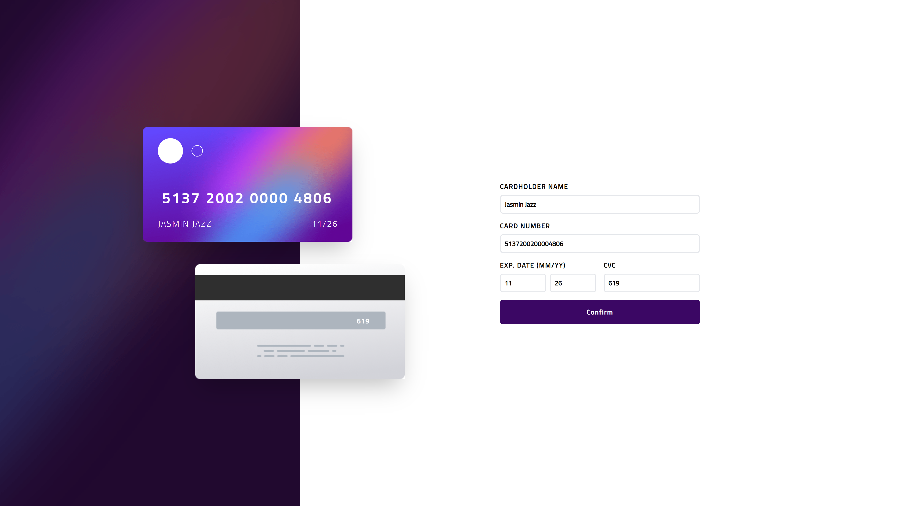
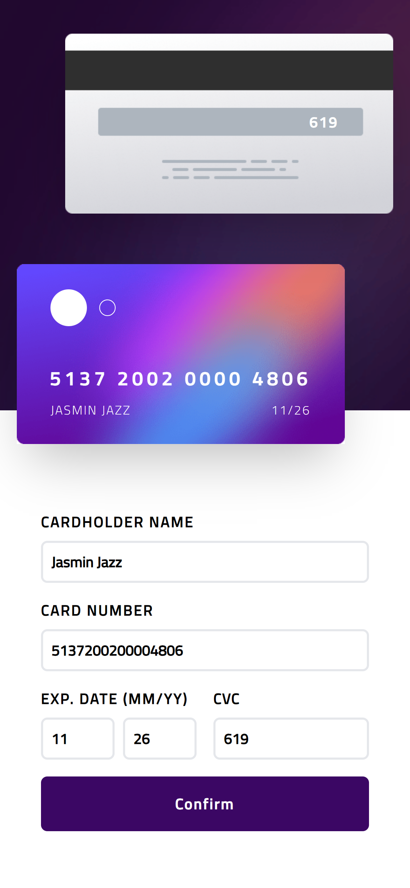

# Frontend Mentor - Interactive card details form

## Table of contents

- [Overview](#overview)
  - [The challenge](#the-challenge)
  - [Screenshots](#screenshots)
  - [Links](#links)
- [My process](#my-process)
  - [What I learned](#what-i-learned)
  - [Possible upgrades](#possible-upgrades)

## Overview

### The challenge

The challenge concerned building out this interactive card details form and getting it looking as close to the design as possible.

### Screenshots

### Links

Solution URL: https://rafalbodanka.github.io/interactive-card-details-form/

## My process

### What I learned

During the challenge, I exercised responsiveness, css flex and grid display. Additionally, I have implemented dynamic form validation and card data display.

### Possible upgrades

 - Personalized front card images.